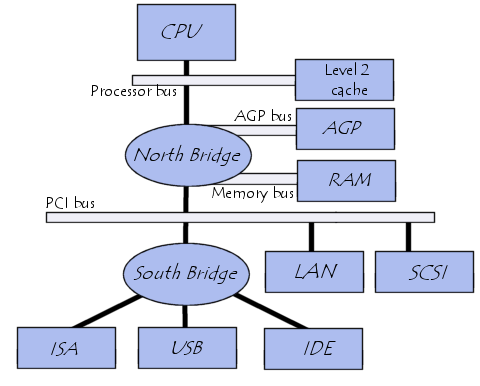

# PC Organization/ Hardware, Address Types, Address Range

## Notes

### CPU and Devices

1. `CPU` interfaces with devices `RAM`, `Disk`, `Keyboard`, `Mouse`, etc.

   1. To interface with each device the device needs a `unique address`.

   2. Device hardware recognises CPU requests to their own address ranges.

---

### Hardware Addresses

- There are 3 types of `hardware address`

  1. Memory Addresses

  2. IO Addresses

  3. Memory Mapped IO Addresses

1. **Memory Addresses**

   1. Used to access `RAM`.

   2. Used to store `program code data`, `heap`, `stack`, `OS`, etc.

   3. Communicates via the `memory bus`.

   4. Accessed by `LOAD` / `STORE` instructions.

   5. Range: 0 <--> 2^32 -1

   * **IBM/PC RAM Layout**

     ```
     +~~~~~~~~~~~~~~~~~~~~~~~~~~~~~~~~~
     + Unused
     +
     +--------------------------------- <= MAX RAM in system.
     + Extended Memory                     * Used in modern systems.
     +
     +--------------------------------- <= 0x00100000 (1 MB)
     + BIOS ROM                            * Used in modern systems.
     + -------------------------------- <= 0x000f0000 (960 KB)
     + 16 Bit Devices / Expansion ROM
     +--------------------------------- <= 0x000C0000 (768 KB)
     + VGA Display
     +--------------------------------- <= 0x000A0000 (640 KB)
     + Low Memory
     +--------------------------------- <= 0x00000000
     ```

2. **IO Addresses**

   1. Used to access `IO Devices`.

   2. Communicates via the `IO bus`. NB: Completely isolated from memory.

   3. Address range defined for specific device by IBM PC standard.

   4. Accessed by `IH` / `OUT` instructions.

   5. Range: 0 <---> 2^16 - 1

3. **Memory Mapped IO**

   1. `Memory Mapped IO` is used to provide more IO address space.

   2. Devices and RAM use the same address space.

   3. IO devices are accessed with memory based instructions e.g. `LOAD` / `STORE`.

   4. Address ranges defined by Standards and/or `BIOS` or `OS` (`Plug and Play`).

   * **IBM PC RAM Layout**

     ```
     +--------------------------------- <= 0xFFFFFFFF (4 GB)
     + 32 Bit -Memory Mapped Devices
     +~~~~~~~~~~~~~~~~~~~~~~~~~~~~~~~~~
     + Unused
     +
     +--------------------------------- <= MAX RAM in system.
     + Extended Memory                     * Used in modern systems.
     +
     +--------------------------------- <= 0x00100000 (1 MB)
     + BIOS ROM                            * Used in modern systems.
     + -------------------------------- <= 0x000f0000 (960 KB)
     + 16 Bit Devices / Expansion ROM
     +--------------------------------- <= 0x000C0000 (768 KB)
     + VGA Display
     +--------------------------------- <= 0x000A0000 (640 KB)
     + Low Memory
     +--------------------------------- <= 0x00000000
     ```

---

### IBM PC Motherboard Bus Architecture



1. `CPU` is attached to `Level 2 Cache` via the `Processor bus` (a.k.a `front side bus`).

2. `CPU` is attached to the `North Bridge`.

3. `North Bridge` attached to `RAM` via `Memory bus`.

4. _`North Bridge` attached to `AGP` (Accelerated Graphics Port) via `AGP bus`_. __Legacy__.

5. `North Bridge` attached to `LAN` via `PCI bus`.

6. `North Bridge` attached to `SCSI` via `PCI bus`.

7. `North Bridge` attached to `South Bridge` via `PCI bus`.

8. `South Bridge` attached to `ISA`, `IDE`, `USB`, etc.

---

### x86 Processor Architecture

```
15     8,7     0    16bit 32bit 64bit
 +------+------+
 |  AH  |  AL  |    AX    EAX   RAX    General Purpose
 +------+------+
 |  BH  |  BL  |    BX    EBX   RBX    General Purpose
 +------+------+
 |  CH  |  CL  |    CX    ECX   RCX    General Purpose
 +------+------+
 |  DH  |  DL  |    DX    EDX   RDX    General Purpose
 +------+------+
 |     BP      |    Base Pointer Register
 +-------------+
 |     SI      |    Stack Index Pointer Register
 +-------------+
 |     DI      |    Destination Pointer Register
 +-------------+
 |     SP      |    Stack Pointer Register
 +-------------+
 |     IP      |    Instruction Pointer Register
 +-------------+
 |     CS      |    Code Segment Register
 +-------------+
 |     SS      |    Stack Segment Register
 +-------------+
 |     DS      |    Data Segment Register
 +-------------+
 |     ES      |    Extra Segment Register
 +------+------+

1. General Purpose Registers - AX, BX, CX, DX.

2. Pointer Registers - BP, SI, DI, SP, IP.

   NB: BP - Points to a frame in the stack ('stack frame').
       SP - Points to the bottom of the stack.

3. Instruction Pointer Register - IP.

   NB: Points to the instruction being executed.

4. Segment Registers - CS, SS, DS, ES.


Real Mode Memory Access - (SegmentBase << 4) + OffSet

     NB: Multiply required address by 16 and add offset.

     NB: Real mode is pre bootloader in x86 architectures.
```

> The x86 architecture has always been `backward compatible`.

---

## References

* [PC Organization/ Hardware, Address Types, Address Range](https://www.youtube.com/watch?v=mio9OsckCZM&list=PLEJxKK7AcSEGPOCFtQTJhOElU44J_JAun&index=2)

* [Notes](https://nptel.ac.in/content/storage2/nptel_data3/html/mhrd/ict/text/106106144/lec3.pdf)

* [BOCHS I/O Ports Address List](http://bochs.sourceforge.net/techspec/PORTS.LST)

* [Computer Bus - Wikipedia](https://en.wikipedia.org/wiki/Bus_(computing))

* [System bus](https://en.wikipedia.org/wiki/System_bus)

    * [Control bus](https://en.wikipedia.org/wiki/Control_bus)

    * [Address bus](https://en.wikipedia.org/wiki/Bus_(computing)#Address_bus)

    * [Data bus](https://en.wikipedia.org/wiki/Memory_bus)

* [North Bridge](https://en.wikipedia.org/wiki/Northbridge_(computing))

* [PCI bus - Wikipedia](https://en.wikipedia.org/wiki/Conventional_PCI)

* [South Bridge](https://en.wikipedia.org/wiki/Southbridge_(computing))

* [AGP bus - Wikipedia](https://en.wikipedia.org/wiki/Accelerated_Graphics_Port) - Legacy

